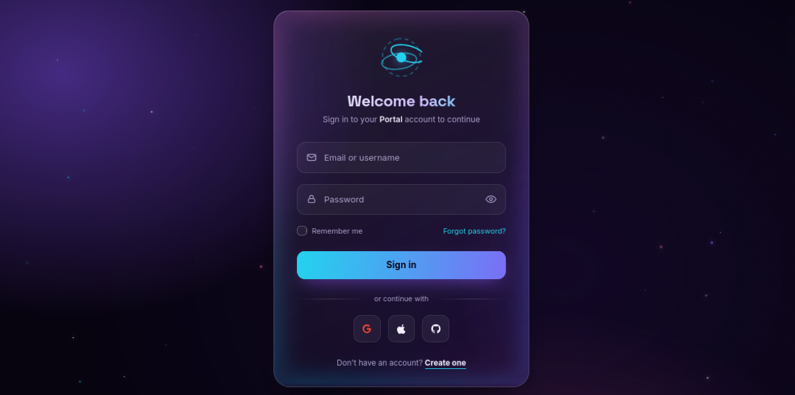

# 🚀 Cyberpunk Aurora Login Page

A stunning, futuristic **Sign-In Portal** designed to showcase advanced front-end techniques. This UI features a dynamic aurora sky, floating particle networks, a glass-morphism card, and an immersive 3D tilt effect that follows your cursor.

<!-- 👆 Replace this with an actual screenshot of your page! -->

## ✨ Live Demo
[View Live Demo](#) *(https://imanibme-h.github.io/Login/)*

## 🌟 Key Features

- **Dynamic Aurora Background** – Smooth, organic gradients drifting endlessly in the background.
- **Interactive Particle System** – Glowing, floating particles drawn on an HTML Canvas that react to the environment.
- **Spinning Halo Border** – A conic-gradient border that rotates continuously around the glass card.
- **3D Mouse Tilt Effect** – The login card rotates in 3D space based on your mouse position.
- **Glassmorphism UI** – Frosted glass effect with `backdrop-filter`, subtle borders, and soft shadows.
- **Password Visibility Toggle** – Show/hide password with a dynamic eye icon.
- **Button Micro-interactions** – Smooth "shine" sweep animation on hover and a "ripple" effect on click.
- **Cursor Spotlight** – A radial gradient highlight that follows your mouse over the card.
- **Fully Responsive** – Adapts perfectly to mobile, tablet, and desktop screens.
- **Accessibility First** – Respects `prefers-reduced-motion` for users who prefer minimal animations.

## 🛠️ Tech Stack

| Technology | Usage |
| :--- | :--- |
| **HTML5** | Semantic markup and structure |
| **CSS3** | Custom properties, Flexbox, Conic gradients, Keyframe animations, `@property` |
| **Vanilla JS** | Canvas API, `requestAnimationFrame`, Mouse events, DOM manipulation |

## 📂 Project Structure
